# Отчёт о выполнении задачи "Охранная система "Гриф""

- [Отчёт о выполнении задачи "Охранная система "Гриф""](#отчёт-о-выполнении-задачи-name)
  - [Постановка задачи](#постановка-задачи)
  - [Известные ограничения и вводные условия](#известные-ограничения-и-вводные-условия)
    - [Цели и Предположения Безопасности (ЦПБ)](#цели-и-предположения-безопасности-цпб)
  - [Архитектура системы](#архитектура-системы)
    - [Компоненты](#компоненты)
    - [Алгоритм работы решения](#алгоритм-работы-решения)
    - [Описание сценариев, при которых ЦБ нарушаются](#описание-сценариев-при-которых-цб-нарушаются)

## Постановка задачи
Компания создаёт охранную систему для защиты территории предприятия или частного сектора. Поэтому нужна функция автономного выполнения задачи.
Мы предполагаем, что территория постоянно находтся под угрозой. Поэтому территория должна быть безопасной.
Проход на охраняемую территорию должен осуществляться в соответствиями с уровнями допуска сотрудников/собственников. Также система должна бороться с несанкционированным доступом и в случае физического ущерба ремонтируется автоматически.   

В ходе работы будет выполнено:

- разработать архитектуру (см. далее) охранной системы территории с учётом целей безопасности
- декомпозировать систему и отделить критический для целей безопасности код
- в бортовом ПО нужно внедрить компонент "монитор безопасности" и реализовать контроль взаимодействия всех сущностей системы
- доработать функциональный прототип
- создать автоматизированные тесты, демонстрирующие работу механизмов защиты

Ценности, ущербы и неприемлемые события

|Ценность|Негативное событие|Оценка ущерба|Комментарий|
|:-:|:-:|:-:|:-:|
|Гриф|Отключение связи между сущностями системы|Высокий|Выход системы из строя|
|Ветролов|Система остается без основного источника электропитания|Средний|Отключение энергии|
|Волан|Нарушение связи между сущностями|Средний|Целостность системы нарушена|
|Ромашка|Выход из строя модуля слежения. Потенциальный риск проникновения на территорию|Низкий|Отсутствие контроля территории|
|Терминал управления|Получение полного доступа ко всем данным и настройкам системы|Высокий|Потеря контроля над системой|
|Люди|Система противодействует человеку с допуском на территорию|Низкий|Жертвы среди сотрудников|
|Имущество|При выходе из строя атакующего модуля могут пострадать постройки, и инфраструктура территории |Средний|Повреждение инфраструктура|

## Известные ограничения и вводные условия
### Цели и Предположения Безопасности (ЦПБ)
Цели безопасности:
1. Выполняются только авторизованные системой команды
2. Только авторизованные пользователи имеют доступ к охраняемой территории
3. Только авторизованные пользователи имеют доступ к терминалу управления
4. Роботы решают ситуацию с злоумышленником в соответствии с законом
5. Анализ инцидента должен происходить за 5 секунд

Предположения безопасности:
1. Система kollektiv благонадёжна
2. Аутентичные пользователи благонадёжны и обладают необходимой квалификацией
3. Только авторизованные пользователи управляют системами

## Архитектура системы
Базовый сценарий
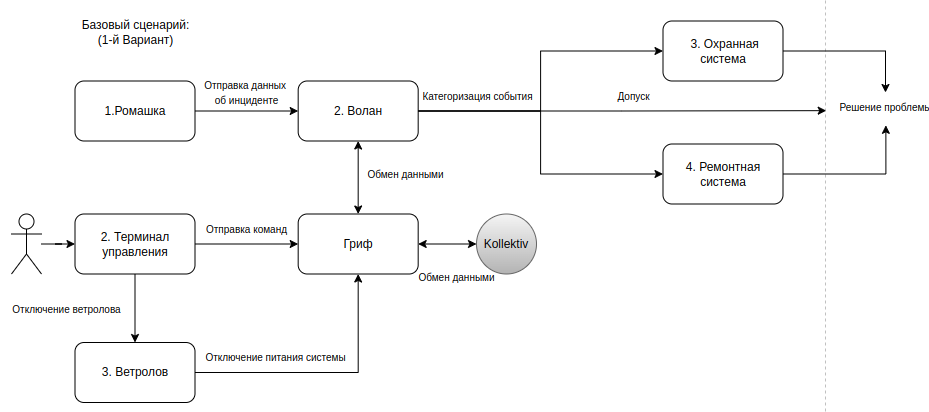

Сценарий работы 1
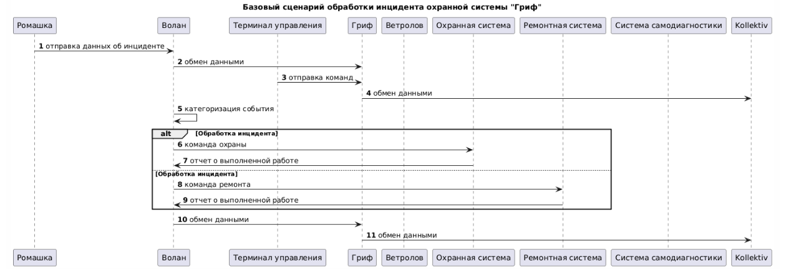

Сценарий работы 2
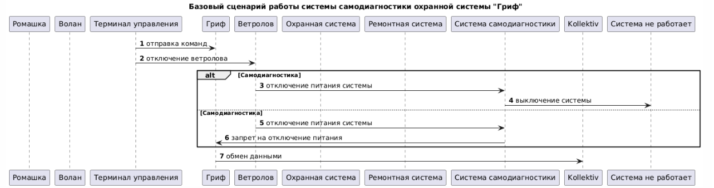

### Компоненты 
Базовая архитектура
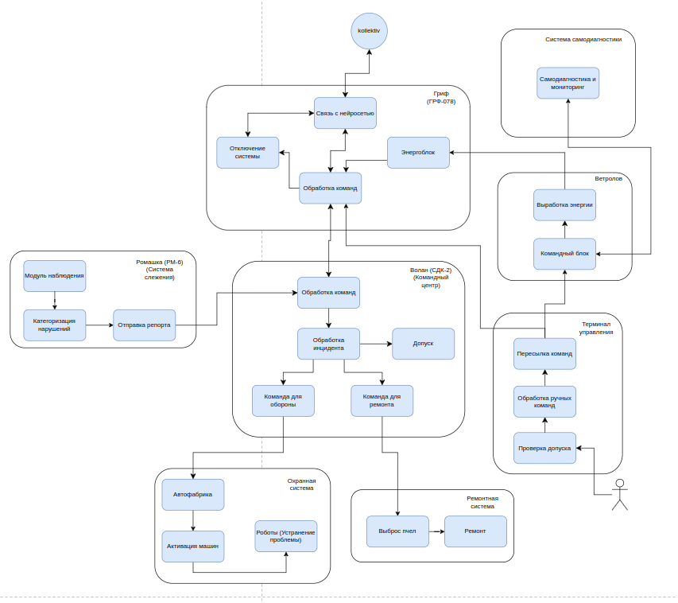

Базовая диаграмма последовательностей
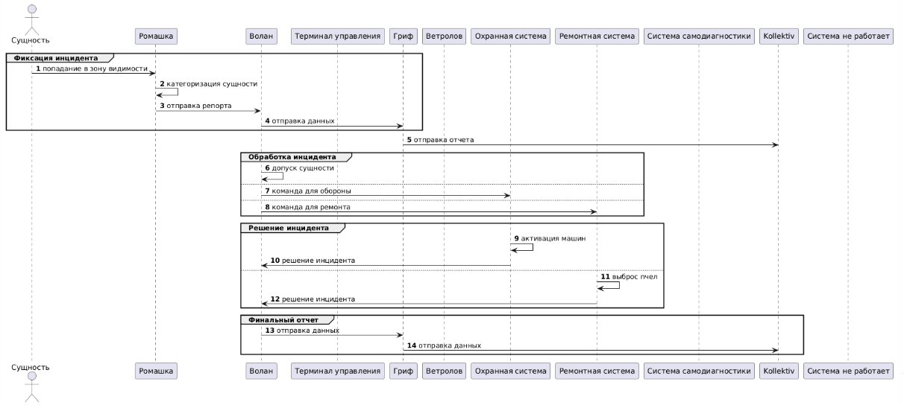

Описание модулей
|Компонент|Назначение|
|:-:|:-:|
|Гриф|Ретранслятор данных, парящий в воздухе над охраняемой площадью|
|Ветролов|Ветрогенератор энергии|
|Терминал управления|Устройство мануального управления|
|Волан|Центр обработки команд|
|Ромашка|Система наблюдения|
|Охранная система|Система охраны периметра участка|
|Ремонтная система|Система починки  устройств|
|Самодиагностика|Проверяет запросы в терминале управления|

### Алгоритм работы решения

### Описание сценариев, при которых ЦБ нарушаются
Нарушение ЦБ (Целей безопасности) в базовом решении

Напоминание ЦБ:
1. Выполняются только авторизованные системой команды
2. Только авторизованные пользователи имеют доступ к охраняемой территории
3. Только авторизованные пользователи имеют доступ к терминалу управления
4. Роботы решают ситуацию с злоумышленником в соответствии с законом
5. Анализ инцидента должен происходить за 5 секунд

|Атакованный компонент|ЦБ1|ЦБ2|ЦБ3|ЦБ4|ЦБ5|Кол-во нарушений|
|:--|:-:|:-:|:-:|:-:|:-:|:-:|
|Гриф|🟢|🔴|🔴|🟢|🔴|3/5|
|Ветролов|🟢|🔴|🔴|🟢|🔴|3/5|
|Терминал управления|🔴|🔴|🔴|🟢|🔴|4/5|
|Волан|🟢|🔴|🔴|🟢|🔴|3/5|
|Ромашка|🟢|🔴|🔴|🟢|🔴|3/5|
|Самодиагностика|🔴|🟢|🟢|🟢|🟢|1/5|
|Охранная система|🟢|🟢|🟢|🔴|🟢|1/5|
|Ремонтная система|🟢|🟢|🟢|🔴|🟢|1/5|

🟢 - ЦБ не нарушена 🔴 - ЦБ нарушена

|Название сценария|Описание|
|---|----------------------|
|НС-1|Злоумышленник получает физический доступ к терминалу управления и вводит команды, которые приводят к отключению системы охраны или изменению её параметров.|
|НС-2|Злоумышленник взламывает систему наблюдения, что приводит к потере видеоданных или их подмене. Это может скрыть действия злоумышленника на охраняемой территории.|
|НС-3|Злоумышленник перехватывает или подменяет данные, передаваемые через ретранслятор "Гриф".|
|НС-4|Из-за перегрузки или сбоя в системе "Волан" анализ инцидента занимает более 5 секунд, что приводит к задержке реакции на угрозу.|
|НС-5|Роботы, действуя по ошибочным командам или из-за сбоя в системе, применяют чрезмерную силу или нарушают закон при задержании злоумышленника.|
|НС-6|Злоумышленник саботирует ветрогенератор "Ветролов", что приводит к отключению питания критически важных систем.|
|НС-7|Злоумышленник сбивает или повреждает "Гриф", что приводит к потере связи между устройствами.|
|НС-8|Злоумышленник внедряет вредоносное программное обеспечение в центр обработки команд "Волан", что приводит к выполнению несанкционированных команд.|
|НС-9|Злоумышленник повреждает "Ромашки", создавая слепую зону на охраняемой территории.|
|НС-10| Из-за программной ошибки или физического повреждения "Охранная система" перестаёт реагировать на попытки проникновения.|
|НС-11|Злоумышленник получает доступ к системе починки устройств.|
|НС-12|Злоумышленник организует DDoS-атаку на центр обработки команд "Волан", что приводит к задержке обработки команд и невозможности своевременно реагировать на угрозы.|
|НС-13|Злоумышленник повреждает терминал управления, что делает невозможным ручное управление системой в экстренных ситуациях.|
|НС-14|Злоумышленник получает контроль над роботами и использует их для нанесения ущерба охраняемой территории или людям, находящимся на ней.|
|НС-15| Злоумышленник перехватывает конфиденциальные данные, передаваемые через ретранслятор "Гриф", что приводит к утечке информации о системе безопасности.|

**Негативный сценарий - НС-1:**

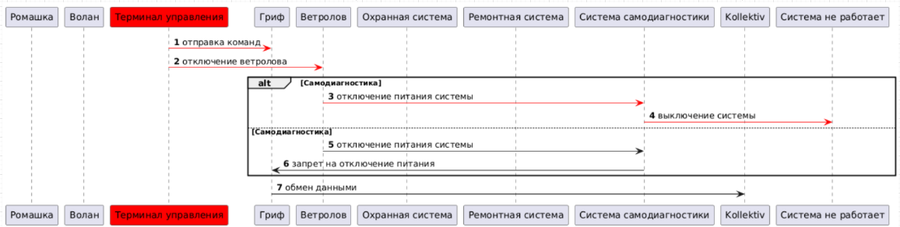

**Негативный сценарий - НС-2:**

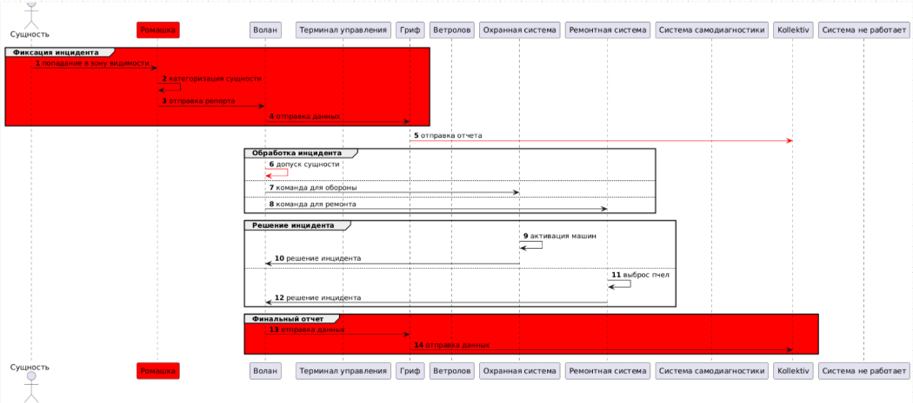

**Негативный сценарий - НС-2:**

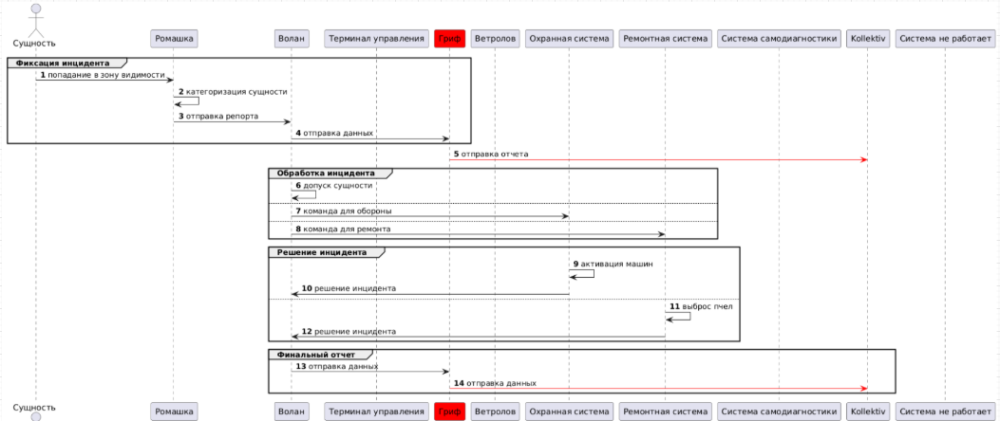

**Негативный сценарий - НС-4:**

**Негативный сценарий - НС-5:**

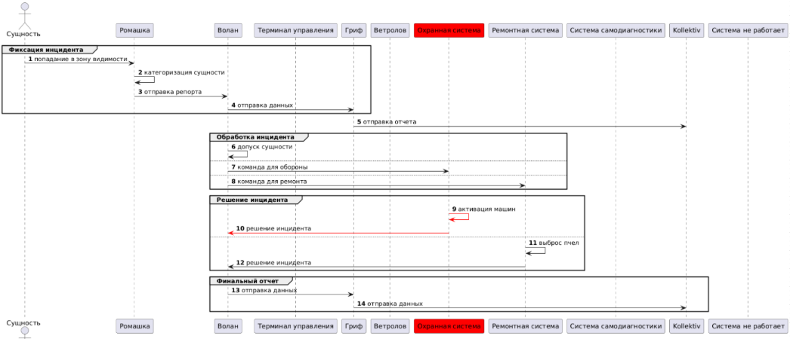

**Негативный сценарий - НС-6:**

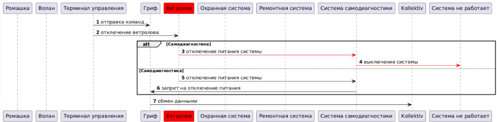

**Негативный сценарий - НС-7:**

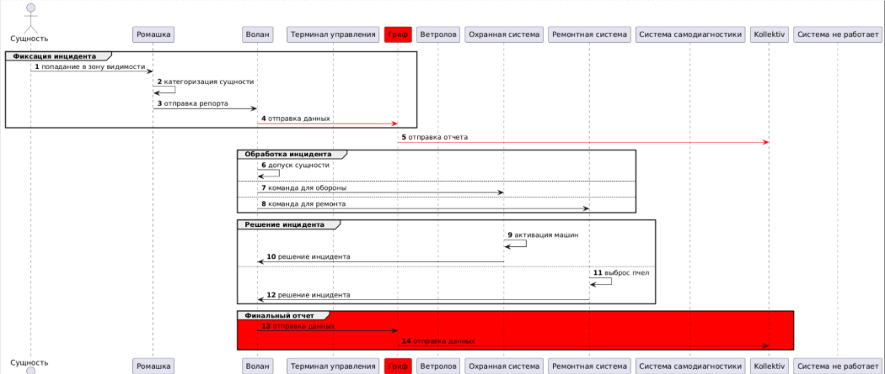

**Негативный сценарий - НС-8:**

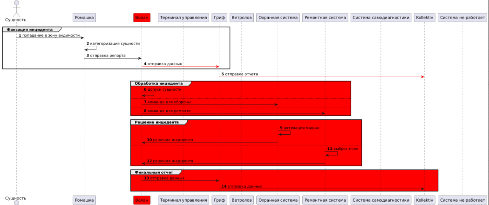

**Негативный сценарий - НС-9:**

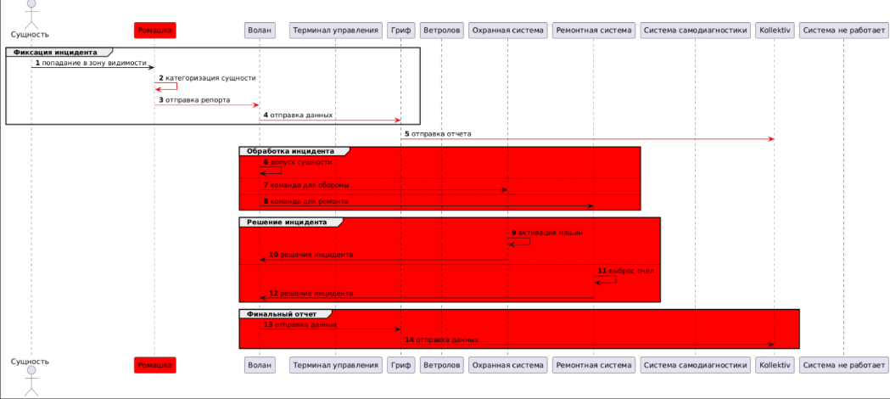

**Негативный сценарий - НС-10:**

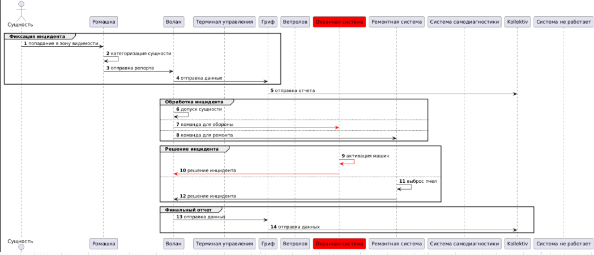

**Негативный сценарий - НС-11:**

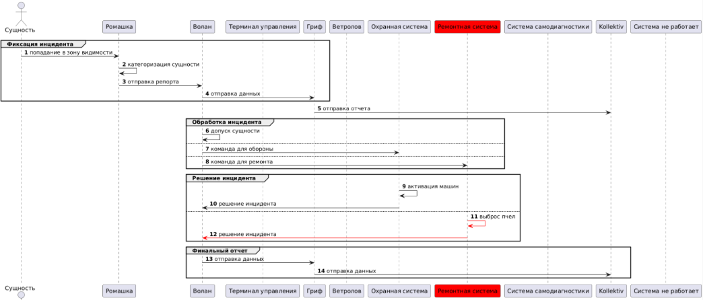

**Негативный сценарий - НС-12:**

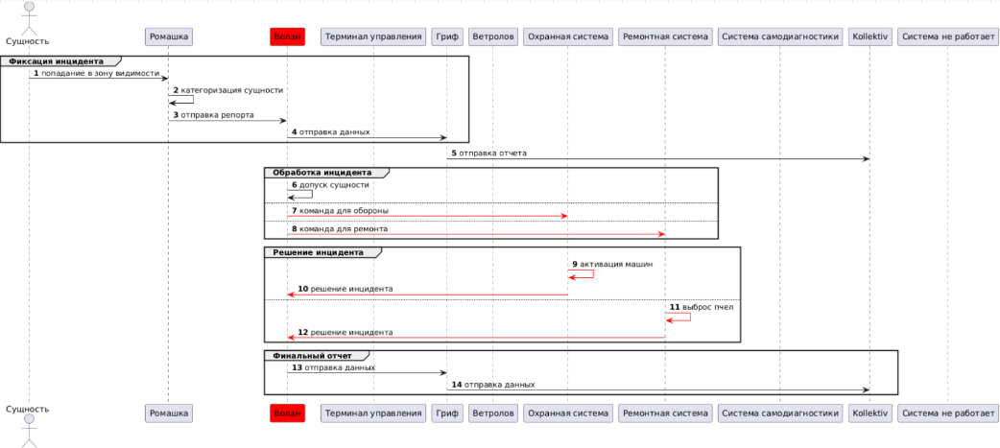

**Негативный сценарий - НС-13:**

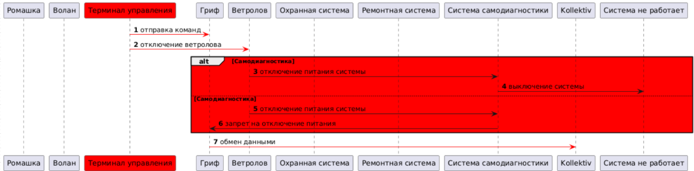

**Негативный сценарий - НС-14:**

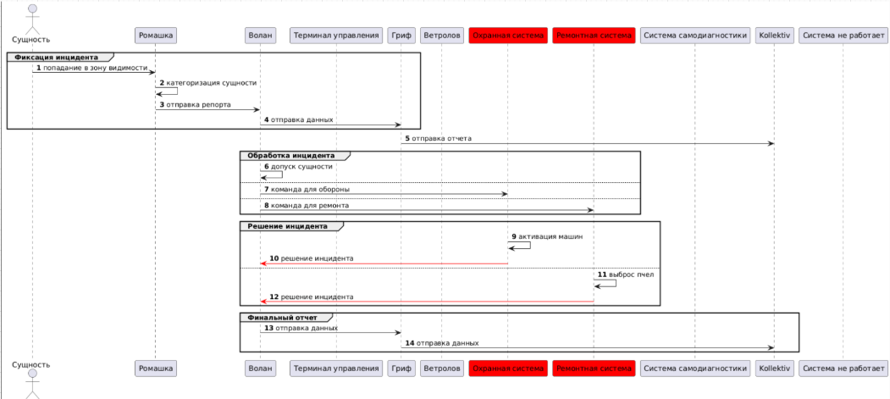

**Негативный сценарий - НС-15:**

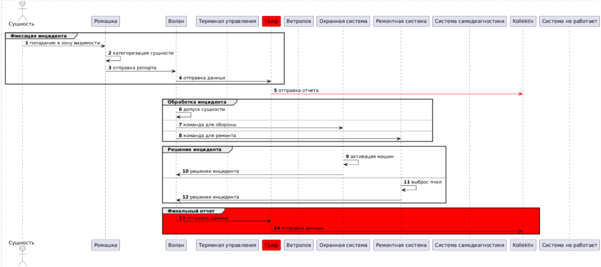
