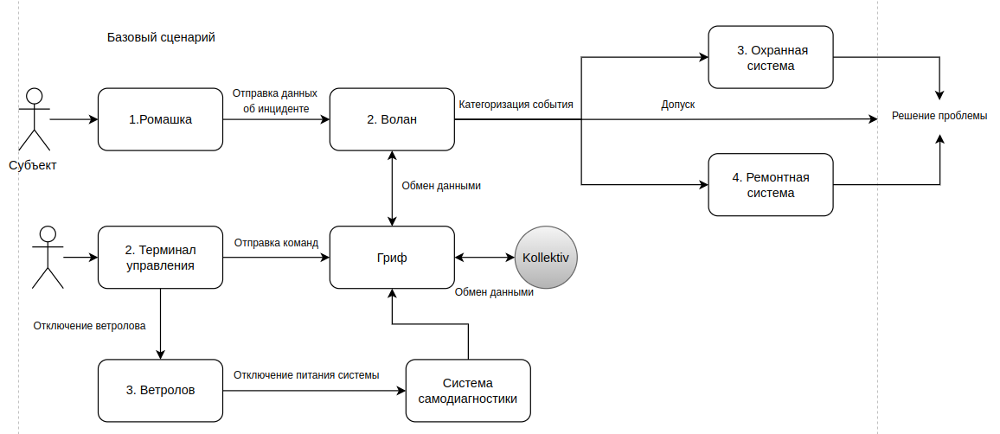

# Отчёт о выполнении задачи "Охранная система "Гриф""

## Постановка задачи
Компания создаёт охранную систему для защиты территории предприятия или частного сектора. Поэтому нужна функция автономного выполнения задачи.
Мы предполагаем, что территория постоянно находтся под угрозой. Поэтому территория должна быть безопасной.
Проход на охраняемую территорию должен осуществляться в соответствиями с уровнями допуска сотрудников/собственников. Также система должна бороться с несанкционированным доступом и в случае физического ущерба ремонтируется автоматически.   

В ходе работы будет выполнено:

- разработать архитектуру (см. далее) охранной системы территории с учётом целей безопасности
- декомпозировать систему и отделить критический для целей безопасности код
- в бортовом ПО нужно внедрить компонент "монитор безопасности" и реализовать контроль взаимодействия всех сущностей системы
- доработать функциональный прототип
- создать автоматизированные тесты, демонстрирующие работу механизмов защиты

Ценности, ущербы и неприемлемые события

|Ценность|Негативное событие|Оценка ущерба|Комментарий|
|:-:|:-:|:-:|:-:|
|Гриф|Отключение связи между сущностями системы|Высокий|Выход системы из строя|
|Ветролов|Система остается без основного источника электропитания|Средний||
|Волан|Нарушение связи между сущностями|Средний||
|Ромашка|Выход из строя модуля слежения. Потенциальный риск проникновения на территорию|Низкий||
|Терминал управления|Получение полного доступа ко всем данным и настройкам системы|Высокий||
|Люди|Система противодействует человеку с допуском на территорию|Низкий||
|Имущество|При выходе из строя атакующего модуля могут пострадать постройки, и инфраструктура территории |Средний||

## Известные ограничения и вводные условия
### Цели и Предположения Безопасности (ЦПБ)
Цели безопасности:
1. Выполняются только авторизованные системой команды
2. Только авторизованные пользователи имеют доступ к охраняемой территории
3. Только авторизованные пользователи имеют доступ к терминалу управления

Предположения безопасности:
1. Система kollektiv благонадёжна
2. Аутентичные пользователи благонадёжны и обладают необходимой квалификацией
3. Только авторизованные пользователи управляют системами

## Архитектура системы
Базовый сценарий

Сценарий работы

